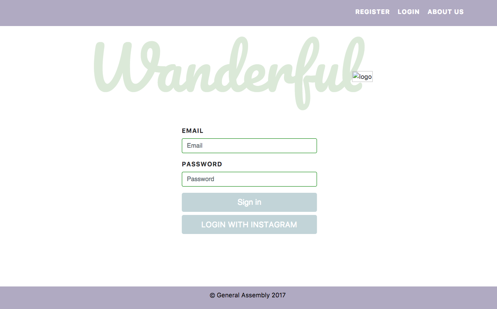
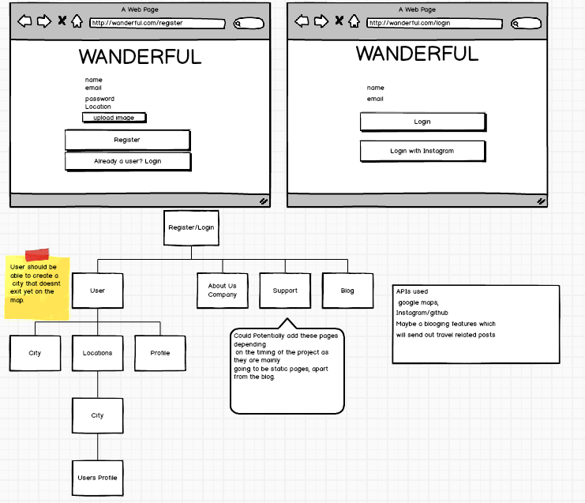
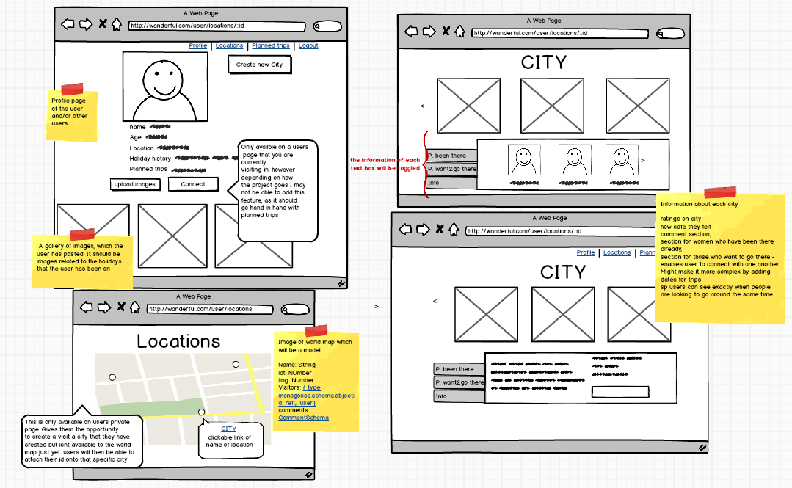
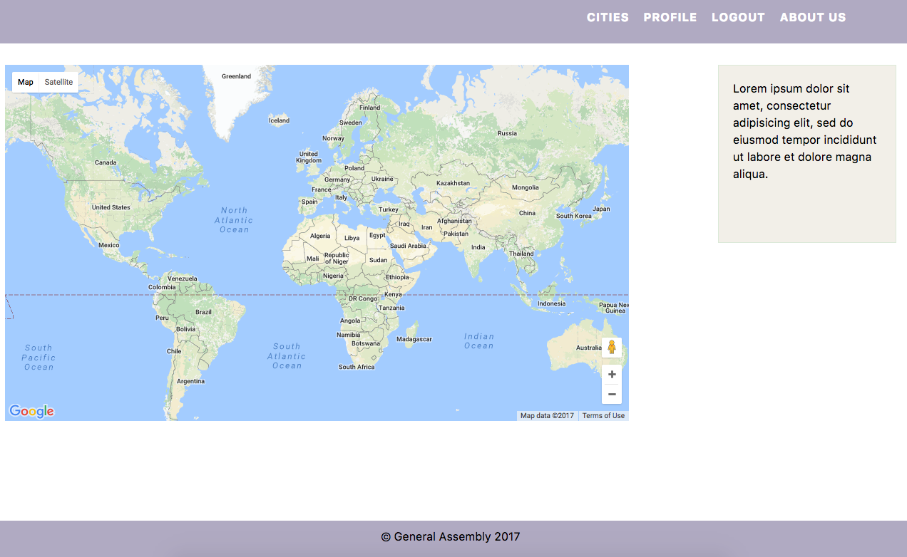
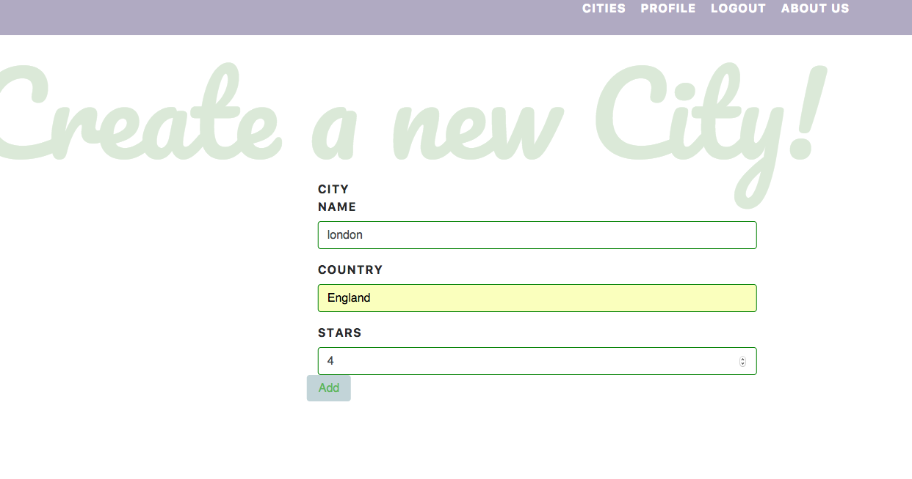

# Project-2

# Wanderful

### GA WDI London - Project 2

#### Wanderful - Travelling App for solo Female travellers

This app was meant for solo travellers to connect and share their travelling experiences across the world.

[View it here!](https://cryptic-shelf-72611.herokuapp.com/ "Here!")

### Planning
In terms of planning I felt as there was going to be alot of functionality within the app I wanted to make sure that the user experience was smooth and that the user was exactly aware of what was going on.

#### Approach / How it works

As the app is aimed for females, only female travellers are allowed to sign up. Users are then able to create a Profile, listing their information, such as where they currently live and would like to visit. They also have the option of uploading images, capturing their trips.

With the use of the Google maps API, The "locations" page displays out all the cities which users have visited.

If a city has not been 'visited' by any of the 'Wanderful' members, the user is able to 'create' the city and storing it into the 'Wanderful' database.

On each city show page, users can upload images that are either related to the city, or of themselves travelling to the city. Users can also communicate with eachother through the comments and share their experiences.

####The build

* Node.js
* Express
* SAAS
* jQuery
* JavaScript
* HTML
* CSS3
* Google Apps Api

#### Problems & Challenges

The biggest I challenged I faced was my poor time management. I underestimated how long it would take me to style the pages. I spent a lot of time trying to perfect the functionality which made me neglect the styling.

I also now realise, had I planned he process more thorough, then I probably would have half the time on the backend and moving on to the styling.

#### Things that I would do differently or better

The most important thing to is plan the process in more detailed using tools such as Trello. Using cards to decide each day what my focus will make the workload less overwhelming, more organised and therefore more efficient. That way I also know how long to spend on each problem before moving on.

In terms of functionality I also wanted to add safety feature on the app, as that is the most important issue for solo female travellers, I was thinking that it would be great to match travellers up who are looking to visit the same city together.
